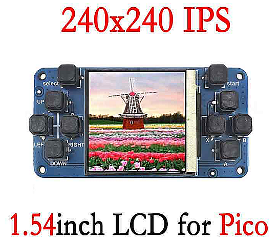
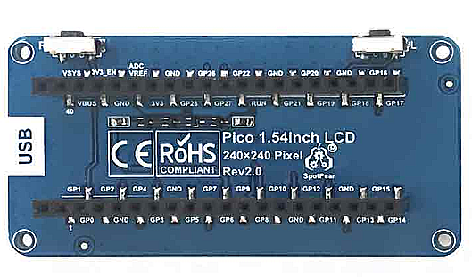

# Pi-Pico-Game-Boy

This is a fork of [YouMakeTech Pi-Pico-Game-Boy](https://github.com/YouMakeTech/Pi-Pico-Game-Boy)

## Why changing
The Pi-Pico-Game-Boy project is really interesting but the hardware I have is different from the one YouMakeTech used.

To make it usable by any similar hardware, I have made hardware definition files that are imported in PicoGameBoy.py so it is transparent to the applications.

since my screen is rotated, I added rotation support to the st7789 driver

## Hardware used



## Todo list
- Adding a menu to call the applications
    - this involves making some changes to the existing applications so they receive the PicoGameBoy instance from the menu instead of creating their own.
- Tetris
    - level management
    - correcting double clicks on some keys (need to locate if the problem is either in PicoGameBoy or in tetris game loop)
- Adding new games to the collection
- Game Of Life
    - Adding some colors to make it more attractive
    - Adding some other rules (for example adding an age parameter to the cells and a life expectancy)
- PicoFlappyBird
    - making it work. Currently exiting with a memory allocation error.
- HungryRain
    - Making it a little more attractive with some sprites for the rocks and the rain for example
    
#Original Readme content
Code for the Raspberry Pi Pico Game Boy

* [YouTube video](https://youtu.be/IP3QVGmd_90)
* [Assembly instructions](https://www.youmaketech.com/raspberry-pi-pico-gameboy/)

## How to Use?
- Install MicroPython on the Raspberry Pi Pico
- Copy the files of this repository to the root directory of a Raspberry Pi Pico
- To automatically start a game when the Raspberry Pi Pico is powered on, rename the game (e.g. tetris.py) to main.py

## Available games
- tetris.py: Tetris
- GameOfLife.py: John Conway's Game of Life
- PicoFlappyBird.py: Flappy Bird, my son's favorite game! *** work in progress ***

## Other files
- st7789.py: MicroPython ST7789 OLED driver, SPI interface
- PicoGameBoy.py: A class to easily write games for the Raspberry Pi Pico Game Boy
- Utils/png2fb.py: Utility to convert a .png image to a framebuffer for the ST7789 display

## How to create new sprites/images for The Pi Pico Game Boy
- Create or open an image in GIMP (max. resolution is 240x240 pixels)
- In GIMP, export the image as a .PNG file: File>Export as...
- In the "Export image as PNG" window, replace "automatic pixel format" by "8bpc RGB" and click Export
- Open a command line and install Pillow for Python:
```
pip install pillow
```
- Convert the image to a bytearray:
```
python png2fb.py corner_12x12.png
```
  or to a .bin file:
```
python png2fb.py tetris_title.png tetris_title.bin
```
- To display a sprite on the Raspberry Pi Pico GameBoy:
```
>>> from PicoGameBoy import PicoGameBoy
>>> pgb=PicoGameBoy()
>>> corner=bytearray(<copy & paste the output of "python png2fb.py corner_12x12.png" here>)
>>> pgb.add_sprite(corner,12,12) # load corner_12x12.png data into sprite #0. sprite #0 is 12x12 pixels
>>> pgb.fill(0)                  # fill the screen in black
>>> pgp.sprite(0,120,120)        # display the sprite in the middle
>>> pgp.show()                   # transfer the frame buffer to the actual screen over the SPI bus
```
- To display a full size image (240x240 pixels) from a .bin file:
```
>>> from PicoGameBoy import PicoGameBoy
>>> pgb=PicoGameBoy()
>>> pgb.load_image("tetris_title.bin") # load the .bin file into the framebuffer
>>> pgb.show()
```
